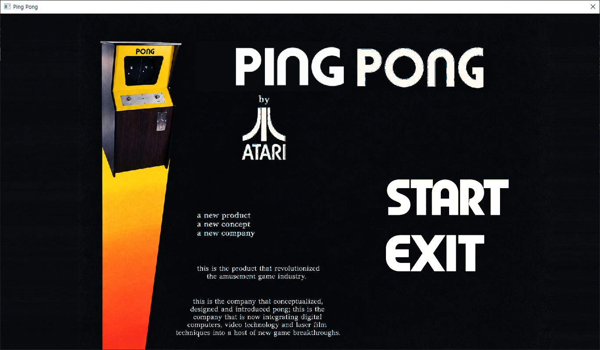
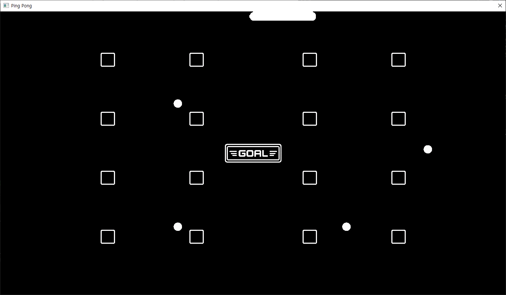
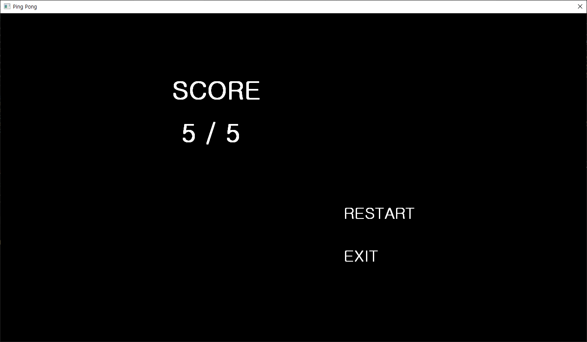

# Ping Pong - 게임 기획서

## 게임 개요

- **게임 제목**: Ping Pong
- **장르**: 2D 아케이드 / 액션
- **플레이 인원**: 1인
- **개발 환경**: Visual Studio 2022 / C++
- **조작**: 마우스

Ping Pong은 고전 게임 Pong의 **공과 BAR의 반사**를 기반으로 한 1인용 아케이드 게임이다.

## 조작 방법
마우스로 하나의 BAR를 화면 가장자리를 따라 이동시킨다.
- BAR는 화면 내부로 들어갈 수 없다.
- 상단/하단에서는 가로 형태
- 좌측/우측에서는 세로 형태
- 모서리를 통과하면 방향이 자동으로 변경된다.

## 게임 목적
- 여러 개의 공 중 최대한 많은 공을 화면 중앙의 Goal영역에 넣는다.

## 게임 규칙
- 여러 개의 공이 서로 다른 위치와 방향으로 움직인다.
- 공의 개수는 플레이 테스트 후 결정한다.
- 화면 외곽에는 벽이 있는 구간과 없는 구간이 존재한다.
- 벽에 부딪힌 공은 반사된다.
- 벽이 없는 곳으로 공이 향하면 플레이어가 BAR로 막아야 한다.
- BAR와 공이 충돌하면 단순 반사된다.
- Goal에 들어간 공은 화면에서 제거된다.
- 화면 밖으로 나간 공은 Out 처리되고 다시 생성되지 않는다.

## 점수
- Goal에 들어간 공 1개 = 1점

## 종료 조건
- 모든 공이 `Goal` 또는 `Out` 상태가 되면 게임을 종료하고 최종 점수를 표시한다.

## 게임 시작 및 재시작
게임 시작 화면

플레이 화면

종료 화면

## 리소스 출처
-자체 제작 및 ai활용