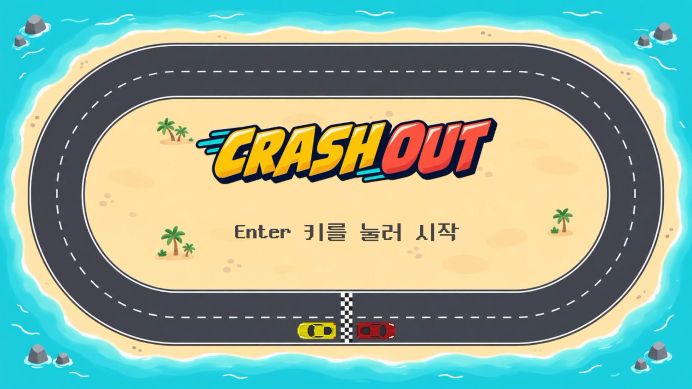
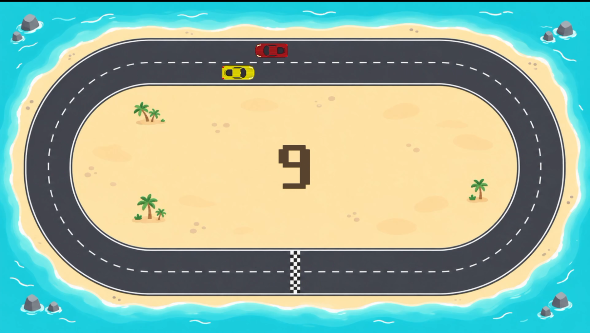
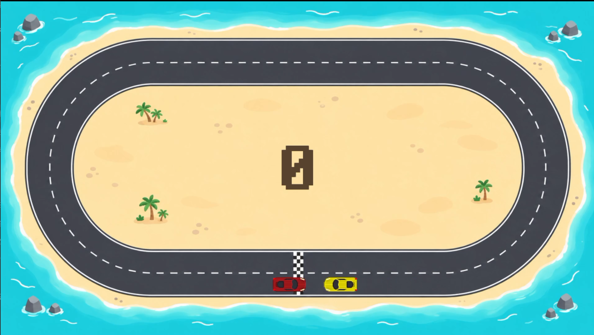
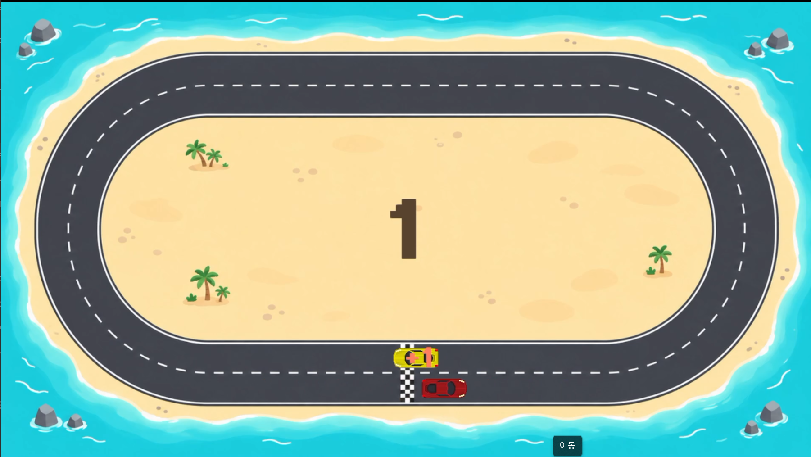
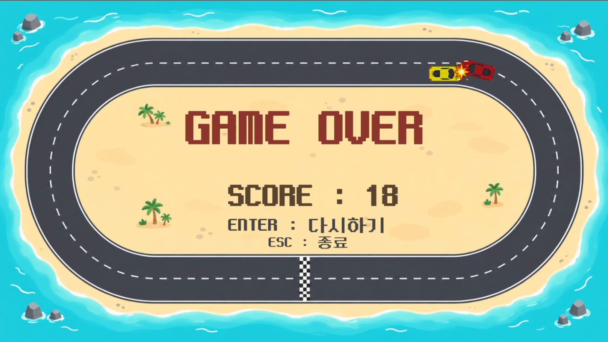

# 게임 기획서 — Crash Out

- **작성자:** 박지환
- **게임 제목:** Crash Out
- **게임 장르:** 2D 자동차 회피 아케이드
- **개발 환경:** C++, Visual Studio 2022, glc2d
- **실행 환경:** Windows PC, 키보드 및 마우스
- **문서 수정일:** 2026년 10월 3일

---

## 1. 게임 개요

Crash Out은 플레이어 자동차와 상대 자동차가 2차선 순환 트랙을 서로 반대 방향으로 주행하는 회피 게임이다. 플레이어는 마우스 왼쪽 클릭으로 안쪽과 바깥쪽 차선을 전환하며 상대 자동차와의 충돌을 피한다.

두 자동차는 자동으로 주행하며, 플레이어는 속도나 진행 방향을 직접 조종하지 않는다. 트랙을 한 바퀴 완주하거나 가까운 상대를 차선 변경으로 회피하면 점수를 얻는다. 완주할수록 두 자동차의 속도가 증가하며, 충돌하면 게임이 종료된다.

## 2. 게임 목적

상대 자동차의 위치와 차선 변경을 살피면서 충돌을 피하고, 완주 점수와 회피 보너스를 통해 최대한 높은 점수를 기록하는 것이다.

단순한 클릭 조작으로 쉽게 시작할 수 있도록 하며, 속도 증가와 상대의 무작위 차선 선택으로 반복 플레이 중에도 긴장감을 느끼게 한다.

## 3. 조작 방법

| 입력 | 사용 화면 | 기능 |
|---|---|---|
| Enter | 시작 화면 | 새 게임 시작 |
| 마우스 왼쪽 클릭 | 플레이 화면 | 플레이어 자동차의 안쪽·바깥쪽 차선 전환 |
| Enter | 결과 화면 | 새 게임으로 다시 시작 |
| Esc | 시작·결과 화면 | 프로그램 종료 |
| 창 닫기 | 모든 화면 | 프로그램 종료 |

- 게임 창 안의 어느 위치를 클릭해도 차선 변경이 적용된다.
- 마우스 버튼을 누른 채 유지해도 차선이 반복해서 바뀌지 않는다. 새로 누르는 순간마다 한 번 변경된다.
- 시작 화면과 결과 화면에서는 클릭에 의한 차선 변경을 처리하지 않는다.

## 4. 게임 시작 조건

- 프로그램을 실행하면 게임 제목과 시작 안내를 표시한다.
- Enter 키를 누르면 게임 데이터를 초기화하고 플레이 화면으로 전환한다.
- 점수와 완주 바퀴 수는 0으로 초기화한다.
- 두 자동차의 속도를 각각 기본 속도로 되돌리고, 바퀴당 속도 증가량을 초기화한다.
- 두 자동차 모두 바깥쪽 차선에서 시작한다.
- 플레이어 자동차는 시계 방향, 상대 자동차는 반시계 방향으로 주행한다.
- 두 자동차를 아래쪽 직선 구간의 출발선을 사이에 두고 배치한다. 플레이어는 출발선 왼쪽, 상대는 오른쪽에서 시작한다.
- 상대 자동차는 출발 후 첫 번째 곡선 구간부터 무작위 차선 선택을 적용한다.
- 게임 시작 시 시작 효과음을 재생한다.

## 5. 기본 게임 규칙

### 트랙과 자동 주행

- 직선 두 구간과 좌·우 곡선으로 구성된 순환 트랙을 사용한다.
- 트랙에는 안쪽과 바깥쪽 차선이 있으며, 화면과 카메라는 고정한다.
- 두 자동차는 정해진 트랙을 따라 서로 반대 방향으로 자동 주행한다.
- 자동차 이미지는 각 주행 구간의 도로 방향에 맞춰 회전한다.

### 속도 증가

- 플레이어 자동차가 한 바퀴 완주할 때마다 두 자동차의 주행 속도를 같은 양만큼 증가시킨다.
- 처음에는 바퀴당 각 차량의 속도를 40씩 증가시킨다. 속도의 단위는 게임 좌표 기준 초당 이동 거리이다.
- 4바퀴를 완주할 때마다 이후에 적용할 증가량을 이전의 ⅔로 줄인다.
- 4의 배수에 해당하는 바퀴에는 기존 증가량을 적용하고, 다음 바퀴부터 줄어든 증가량을 사용한다.
- 회피 보너스는 점수에만 영향을 주며, 속도 증가나 완주 바퀴 수에 영향을 주지 않는다.

| 완주 바퀴 수 | 해당 구간에서 매 바퀴 각 차량에 더하는 속도 |
|---|---:|
| 1~4바퀴 | 40 |
| 5~8바퀴 | 약 26.67 |
| 9~12바퀴 | 약 17.78 |

### 플레이어 자동차의 차선 변경

- 왼쪽 클릭을 한 번 하면 현재 차선에서 반대 차선으로 즉시 이동한다.
- 직선에서는 진행 방향의 위치를 유지하며 차선을 전환한다.
- 곡선에서는 현재 곡선 각도를 기준으로 반대 차선의 대응 위치로 전환한다.
- 차선 변경 후의 위치에도 충돌 판정을 적용한다.
- 차선 변경 시 효과음을 재생한다.

### 상대 자동차의 차선 변경

- 좌·우 곡선에 진입할 때, 이번 곡선에서 차선을 결정할 지점을 무작위로 정한다.
- 정해진 지점에 도달하면 안쪽과 바깥쪽 중 목표 차선을 같은 확률로 선택한다.
- 현재 차선과 같은 차선을 선택하면 유지하고, 다른 차선을 선택하면 변경한다. 같은 차선이 연속해서 선택될 수 있다.
- 목표 차선 선택은 곡선마다 한 번만 처리한다.
- 변경할 때는 주행을 계속하면서 목표 차선까지 부드럽게 이동한다.
- 차선 변경은 곡선에서 시작하지만, 주행 속도와 시작 지점에 따라 직선 초입까지 이어질 수 있다.
- 차선을 변경하는 도중에도 충돌 판정을 적용한다.

### 충돌과 종료

- 자동차마다 앞·중간·뒤에 원형 충돌 영역을 하나씩 배치한다.
- 원형 영역은 차량의 방향에 맞춰 배치하며, 두 차량의 원 중 하나라도 서로 겹치면 충돌로 처리한다.
- 현재 차량 이미지 크기 71×31을 기준으로 각 원의 반지름은 15.5, 앞뒤 원의 중심은 차량 중심에서 길이 방향으로 각각 20만큼 떨어진 곳에 둔다.
- 충돌하면 두 자동차의 이동을 멈추고, 충돌 효과음과 이미지를 표시한 뒤 결과 화면으로 전환한다.
- 충돌 이미지는 두 자동차 중심의 중간 위치에 표시하고, 결과 화면에서도 유지한다.
- 목숨은 1개이며, 피격 후 무적이나 부활 기능은 사용하지 않는다.

## 6. 점수 규칙

| 항목 | 규칙 |
|---|---|
| 시작 점수 | 0점 |
| 완주 점수 | 플레이어 자동차가 한 바퀴 완주할 때마다 +1점 |
| 회피 보너스 | 가까운 상태에서 차선을 변경한 뒤, 충돌 없이 접근 범위를 벗어나면 +1점 |
| 일반 차선 변경 | 단순히 차선을 변경하는 것만으로는 점수를 주지 않음 |
| 최종 점수 | 완주 점수와 회피 보너스의 합계 |
| 실패 조건 | 상대 자동차와 충돌 |

### 완주 판정

- 플레이어가 트랙을 돌아 아래쪽 직선 구간의 출발선을 다시 통과하면 완주로 판정한다.
- 이전 위치와 현재 위치를 비교하여 출발선을 통과한 순간에 한 번만 점수를 지급한다.
- 시작 위치에 처음 배치된 순간에는 점수를 주지 않는다.
- 완주 바퀴 수와 총점은 별도로 관리한다.

### 회피 보너스 판정과 표시

- 차선을 변경하기 직전, 두 자동차가 충돌하지 않은 상태에서 일정 거리 이내로 가까웠는지 확인한다.
- 가까운 상태에서 실제로 차선을 변경했다면 회피 후보로 기록한다.
- 이후 충돌 없이 접근 범위를 벗어나면 보너스 1점을 지급하고 후보 상태를 해제한다.
- 클릭하지 않고 상대와 가까이 지나가기만 한 경우에는 회피 후보가 되지 않는다.
- 현재 접근 범위는 충돌 판정 원의 반지름 합 31에 여유 거리 20을 더한 값으로 판정한다.
- 보너스 획득 시 두 자동차 중심의 중간 위치에 ‘+1’을 표시한다. 글자는 약 0.7초 동안 위로 떠오른 뒤 사라진다.
- 점수를 획득하면 점수 효과음을 재생한다.

### 공통 규칙

- 충돌과 점수 획득 조건이 같은 업데이트에서 발생하면 충돌을 우선 처리하며, 해당 업데이트에서는 점수를 추가하지 않는다.
- 목표 점수에 따른 클리어나 제한 시간을 두지 않는다. 충돌할 때까지 기록을 높이는 방식이다.

## 7. 게임 종료와 재시작

- 충돌하면 게임오버 문구, 최종 점수, 재시작·종료 안내를 표시한다.
- 결과 화면에서는 두 자동차와 충돌 효과가 충돌 당시 위치에 정지한 상태로 남는다.
- Enter 키를 누르면 점수, 완주 바퀴 수, 자동차 위치·방향·차선·속도와 속도 증가량을 초기화한다.
- 상대의 차선 선택 상태, 회피 후보 상태, 충돌 효과와 보너스 글자 표시 상태도 초기화한다.
- 초기화 후 새 게임을 시작한다.
- 시작·결과 화면의 Esc 입력 또는 창 닫기로 프로그램을 종료한다.

## 8. 주요 게임 객체

| 객체 | 역할과 행동 |
|---|---|
| 플레이어 자동차 | 시계 방향으로 자동 주행하며 클릭에 따라 즉시 차선을 변경한다. |
| 상대 자동차 | 반시계 방향으로 자동 주행하며 곡선에서 목표 차선을 무작위로 선택하고 부드럽게 이동한다. |
| 트랙 | 직선·곡선의 이동 경로와 두 차선의 위치를 제공한다. |
| 점수 표시 | 완주 점수와 회피 보너스를 합한 현재 점수를 보여 준다. |
| 충돌 효과 | 충돌 위치를 시각적으로 알리고 결과 화면에서도 유지한다. |
| 보너스 글자 | 회피 보너스를 얻었을 때 떠오르는 ‘+1’을 표시한다. |
| 화면 관리 | 시작·플레이·결과 화면의 입력과 출력을 관리하고 화면을 전환한다. |

별도의 장애물과 아이템은 사용하지 않는다. 위 목록은 게임 내 역할을 정리한 것이며, 각 항목을 반드시 별도 클래스로 만들지는 않는다.

## 9. 게임 화면 구성

### 시작 화면

- 트랙과 두 자동차를 배경으로 표시한다.
- 중앙 위쪽에 게임 제목을 표시한다.
- 아래쪽에 Enter를 통한 시작 안내를 표시한다.

*그림 1. 게임 제목과 조작 안내가 표시된 시작 화면.*

### 게임 진행 화면

- 고정된 2차선 순환 트랙 위에 두 자동차를 표시한다.
- 플레이어는 노란색, 상대는 빨간색 자동차로 구분한다.
- 트랙 안쪽의 빈 공간 중앙에 현재 점수를 크게 표시한다.

*그림 2. 서로 반대 방향으로 주행하는 자동차와 현재 점수.*

### 회피 보너스 표시

- 회피 보너스를 획득하면 해당 위치에 밝은 코랄색 ‘+1’을 표시한다.
- 글자는 위로 떠오르다가 사라져 보너스 획득을 알린다.

*그림 3-1. 가까이 접근한 상대 자동차를 회피하기 전의 상황.*

*그림 3-2. 차선 변경으로 회피한 뒤 보너스 1점을 획득한 상황.*

### 결과 화면

- 정지한 게임 화면 위에 결과를 표시한다.
- 중앙에 ‘GAME OVER’를 크게 표시한다.
- 그 아래에 ‘SCORE’와 최종 점수를 표시한다.
- 아래쪽에 Enter 재시작과 Esc 종료 안내를 표시한다.
- 자동차 사이에는 충돌 효과를 표시한다.

*그림 4. 충돌 후 최종 점수와 재시작 안내를 표시한 결과 화면.*

## 10. 게임 진행 흐름

1. 프로그램 실행 후 시작 화면을 표시한다.
2. Enter 입력을 받으면 게임 데이터를 초기화하고 시작 효과음을 재생한다.
3. 입력과 이동 처리 전에 두 자동차의 접근 상태를 확인한다.
4. 플레이어 입력과 상대의 차선 선택 규칙에 따라 두 자동차를 이동시킨다.
5. 이동 후 충돌 여부를 확인한다. 충돌하면 충돌 효과를 표시하고 결과 화면으로 전환한다.
6. 충돌하지 않았다면 차선 변경 직전의 접근 상태를 바탕으로 회피 후보를 기록한다.
7. 완주 여부를 확인하여 점수와 완주 바퀴 수를 갱신하고 두 자동차의 속도를 증가시킨다.
8. 회피 후보가 접근 범위를 벗어나면 보너스 점수와 ‘+1’ 표시를 처리한다.
9. 충돌할 때까지 주행·입력·판정·점수 갱신을 반복한다.
10. 결과 화면에서 Enter로 새 게임을 시작하거나 Esc로 종료한다.

## 11. 사용 이미지와 사운드

### 이미지 및 글자

| 리소스 | 용도 | 사용 방식 |
|---|---|---|
| 2차선 순환 트랙 | 배경과 자동차 경로 표시 | 해변 분위기의 고정 배경 이미지 |
| 플레이어 자동차 | 플레이어 차량 표시 | 노란색 탑다운 자동차 이미지 |
| 상대 자동차 | 상대 차량 표시 | 빨간색 탑다운 자동차 이미지 |
| 타이틀 | 게임 제목 표시 | 시작 화면의 제목 이미지 |
| 충돌 효과 | 충돌 위치 표시 | 자동차 사이에 폭발 이미지 표시 |
| 점수·안내·결과·보너스 | 게임 정보 표시 | Neo둥근모 폰트로 글자 출력 |

### 사운드

| 사운드 | 용도 |
|---|---|
| 게임 시작음 | 새 게임 시작 알림 |
| 차선 변경 효과음 | 플레이어의 차선 변경 알림 |
| 점수 획득음 | 완주 점수 및 회피 보너스 획득 알림 |
| 충돌 효과음 | 충돌 및 게임오버 알림 |

배경음악은 사용하지 않고 주요 행동과 결과를 효과음으로 전달한다.

## 12. 제작 범위

- 직선과 곡선으로 구성된 트랙 1개와 안쪽·바깥쪽 차선 2개.
- 플레이어 자동차와 상대 자동차 각 1대.
- 두 자동차의 자동 주행과 도로 방향에 따른 이미지 회전.
- 클릭 한 번당 한 번 적용되는 플레이어의 즉시 차선 변경.
- 곡선에서 무작위로 목표 차선을 결정하는 상대 자동차의 부드러운 차선 변경.
- 앞·중간·뒤 원 3개를 이용한 차량 충돌 판정.
- 한 바퀴 완주 점수와 회피 보너스 점수.
- 완주에 따른 두 차량의 가속과 4바퀴 단위 속도 증가량 감소.
- 충돌 이미지, 보너스 글자 표시와 행동별 효과음.
- 시작 화면, 플레이 화면, 결과 화면과 재시작·종료 기능.